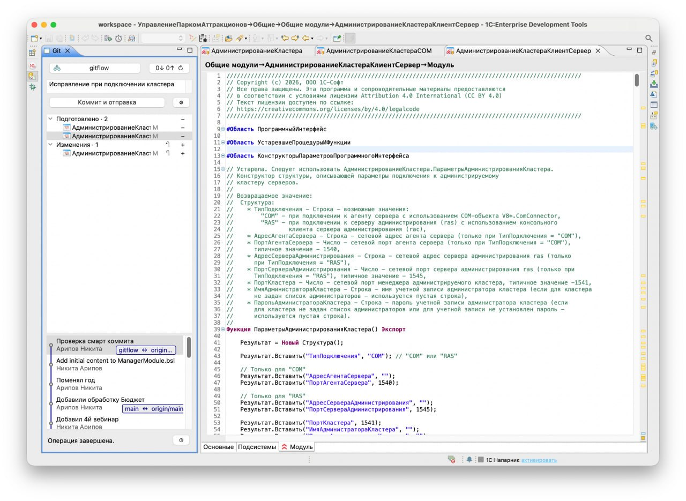

# Git Flow для 1C:EDT

Git Flow помогает работать с Git прямо в 1C:EDT. В отдельной панели можно увидеть
изменённые файлы, подготовить их к коммиту, посмотреть историю, переключить ветку
и отправить изменения. Частые операции, для которых обычно нужно открывать
несколько окон, собраны в одном месте.

[**Установить плагин**](https://oxotka.github.io/git-flow-edt/) · [Видеообзор](https://youtu.be/GiZ9AKqpAUU) · [Telegram автора](https://t.me/AriN1C) · [Сообщить об ошибке](https://github.com/Oxotka/git-flow-edt/issues/new?template=bug_report.yml)



## Установка в EDT

Добавьте в EDT сайт установки и обновления:

```text
https://oxotka.github.io/git-flow-edt/
```

1. Откройте **Справка → Установить новое ПО… → Добавить…**.
2. Укажите имя **Git Flow** и вставьте ссылку в поле адреса.
3. Выберите компонент **Git Flow**, завершите установку и перезапустите EDT.
4. Откройте перспективу **Git** или панель через **Окно → Показать представление → Другие… → Git Flow → Git**.

Для обновления откройте **Справка → Проверить обновления**.
Если плагин уже установлен из ZIP, добавьте ссылку в доступные сайты ПО
в настройках EDT, затем проверьте обновления.

Для установки из файла скачайте ZIP из [последнего релиза](https://github.com/Oxotka/git-flow-edt/releases/latest)
и выберите **Добавить… → Архив…** в окне установки. Архив одинаков для Windows
и macOS; распаковывать его не нужно.

## Совместимость

Git Flow проверен в **1C:EDT 2025.2.6 на Windows** и
**1C:EDT 2026.1.3 на macOS**.

## Первый коммит

Откройте в EDT проект, подключённый к Git-репозиторию, и внесите изменения.
Панель **Git** доступна в перспективе **Git** или через
**Окно → Показать представление → Другие… → Git Flow → Git**.

Если репозиториев несколько, выберите нужный вверху панели.

1. Нажмите `+` рядом с файлами, которые хотите включить в коммит.
   Они появятся в разделе **Подготовлено**. Кнопка `−` убирает файл из коммита,
   сохраняя правки.
2. Напишите сообщение коммита в поле над списком файлов.
3. Нажмите **Коммит и отправка**. Чтобы создать только локальный коммит,
   отключите отправку в настройках кнопкой с шестерёнкой — основная кнопка
   будет называться **Коммит**.

По умолчанию коммит включает только подготовленные изменения. В шестерёнке
можно включить **Автоматическая подготовка изменений**:
при пустом разделе **Подготовлено** будут включены все файлы из списка
**Изменения**, в том числе новые и удалённые. Если есть подготовленные
изменения, коммит включает только их. При включённой автоматической подготовке пустой
раздел **Подготовлено** скрыт и появляется после подготовки файлов.

Когда изменений нет и у локальной ветки ещё нет связи с удалённой, кнопка
**Опубликовать ветку** отправляет существующие коммиты в `origin` и настраивает
связь с одноимённой веткой. Сообщение коммита не требуется.

Название ветки вверху панели открывает выбор веток. Круговая стрелка рядом
со счётчиками входящих и исходящих коммитов запускает синхронизацию:
проверку сервера, получение или отправку изменений в зависимости от состояния ветки.

## Видеообзор

[](https://youtu.be/GiZ9AKqpAUU)

[Смотреть на YouTube](https://youtu.be/GiZ9AKqpAUU).

## Возможности

- **Работать с файлами.** Панель показывает изменённые и подготовленные файлы.
  Кнопки `+` и `−` добавляют файл в будущий коммит или убирают его оттуда.
  Через контекстное меню можно открыть файл, сравнить изменения и посмотреть
  историю. Файлы репозитория вне проектов EDT тоже можно открыть и сравнить,
  включая конфликты. Отмену правок плагин выполняет после подтверждения.
- **Создавать коммиты.** Сообщение можно написать в несколько строк и отправить
  коммит сочетанием `Ctrl+Enter`. Отправка на сервер после коммита включена по
  умолчанию; её можно отключить кнопкой с шестерёнкой. Сообщение синхронизируется
  с полем в штатном **Индексировании Git**, если обе панели показывают один
  репозиторий. После создания коммита оба поля очищаются.
- **Синхронизировать ветку.** Плагин проверяет изменения на сервере перед
  отправкой. Если ветка уже изменилась, он пытается сначала получить новые
  коммиты. При конфликте помогает перейти к штатному слиянию в EDT. После
  такого слияния отправку нужно запустить отдельно. Принудительную отправку
  (`force push`) плагин не делает.
- **Переключать ветки.** Ветки показаны деревом: их можно искать, добавлять в
  избранное и выбирать среди локальных, удалённых веток и тегов. В списке
  показаны относительное время, автор и сообщение последнего коммита. В штатном окне слияния EDT
  доступен такой же выбор веток.
- **Временно убирать изменения.** Быстрый стеш сохраняет текущие правки, а
  команда возврата восстанавливает последний стеш. При создании ветки через
  мастер EDT плагин временно сохраняет локальные изменения и возвращает их
  после закрытия мастера.
- **Показывать историю.** Под списком файлов видны коммиты текущей ветки с
  графом, автором и сообщениями. Для коммита доступны сравнение, копирование
  хеша и другие действия через контекстное меню. На текущем коммите (HEAD)
  доступна **Слить…** — штатная команда из **Групповой разработки** EDT.

В штатном окне **Индексирование Git** кнопка **Фиксировать + Push** (или
**Отправить**, когда коммитить нечего) использует проверку удалённой ветки от
Git Flow.

## Для разработчиков

<details>
<summary>Сборка из исходников</summary>

Нужны JDK 17–21, Maven 3.9+ и EDT 2026.1.3, указанная в
[`releng/edt-2026-1.target`](releng/edt-2026-1.target). Локальная ЕДТ нужна
только для компиляции и не упаковывается в архив.

В target-файле указан локальный путь к установленной EDT на macOS. Перед
сборкой замените его на каталог `plugins` своей установки EDT.

```bash
mvn verify
```

После успешной сборки ZIP-репозиторий обновления находится в
`dev.edt.gitflow.repository/target/`. Этот архив можно выбрать в мастере
установки EDT. Для запуска второго экземпляра EDT с плагином из исходников
используйте конфигурацию PDE с продуктом
`com._1c.g5.v8.dt.product.application.rcp`.

</details>

## Обратная связь

Нашли ошибку или хотите предложить улучшение? Создайте [issue](https://github.com/Oxotka/git-flow-edt/issues).
Для ошибки укажите версии EDT и плагина, операционную систему и шаги воспроизведения.

## Лицензия

[MIT](LICENSE). Copyright © 2026 Никита Арипов.

### Публикация сайта обновления

GitHub Actions публикует сайт на GitHub Pages после выхода стабильного релиза.
Workflow берет p2 ZIP из последнего опубликованного релиза и размещает его
содержимое по постоянному адресу. Плагин повторно не собирается.
При изменении страницы сайта выполняется публикация с тем же последним релизом;
ее также можно запустить вручную через **Actions → Publish EDT update site**.
